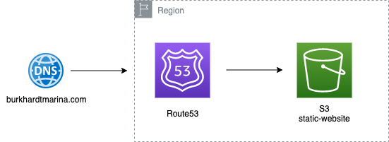
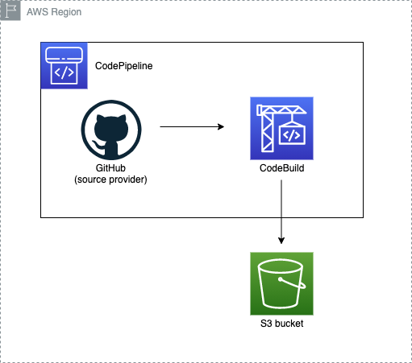

# Web portfolio

Welcome to the repository for my web portfolio. Take a look to this rendered code [here](http://www.burkhardtmarina.com/)

# 🏗 Architecture

My webpage is hosted in AWS, and the following diagram shows how it's implemented:

<p align="center">
  
</p>

# 🚀 CI/CD

This repository is part of a CI/CD implementation that allows the automatic integration and deployment of this code, once new code is pushed to this repository. The architecture diagram shown below reflects the DevOps methodology implemented for this webpage:

<p align="center">
  
</p>

```
Note:
Q: Why do I use CodeBuild and not CodeDeploy's native integration to deploy to S3?
A: Because at the moment there is no way to exclude files (action I look to apply) while copying them from the source provider to the S3 bucket, just a bulk copy or a single object copy.
```