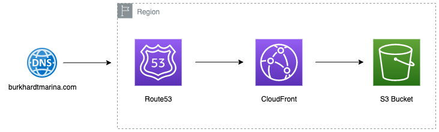
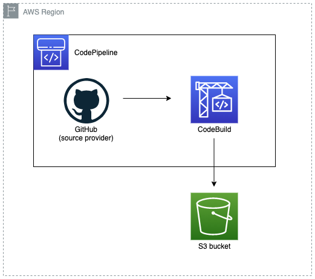

# Web portfolio

Welcome to the repository for my web portfolio. Take a look to this rendered code [here](http://www.burkhardtmarina.com/)

# 🏗 Architecture

My webpage is hosted in AWS, and the following diagrams shows how it's implemented:

<p align="center">
  
</p>

# 🚀 CI/CD

This repository is part of a CI/CD, that allows the automatic implementation and deployment of this code once new code is found. This DevOps methodology is implemented as shown below in the architecture diagram:

<p align="center">
  
</p>

```
Note:
Q: Why do I use CodeBuild and not CodeDeploy's native integration to deploy to S3?
A: Because at the moment there is no way to exclude files (action I look to apply) while copying them from the source provider to the S3 bucket, just a bulk copy or a single object copy.
```